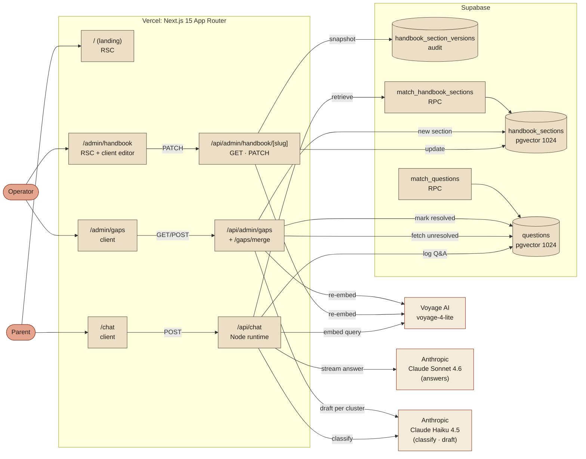
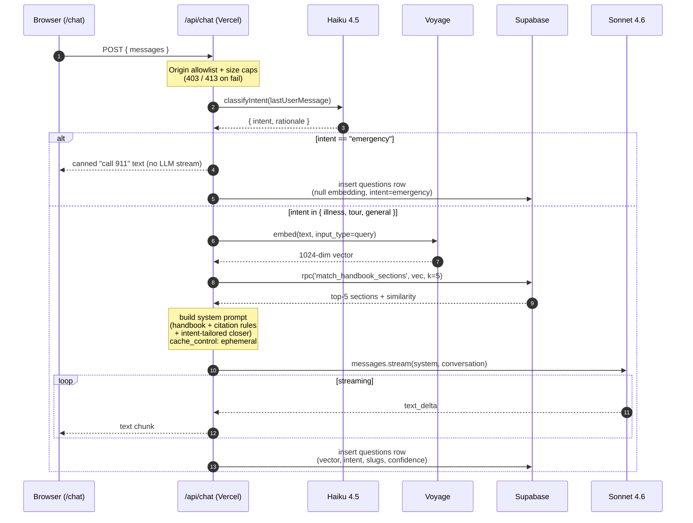
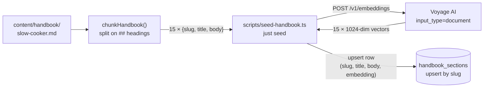
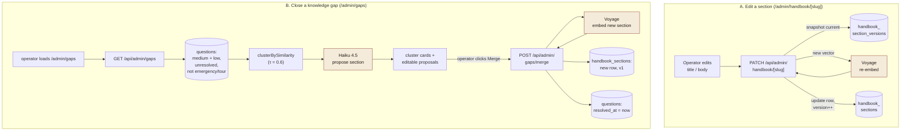
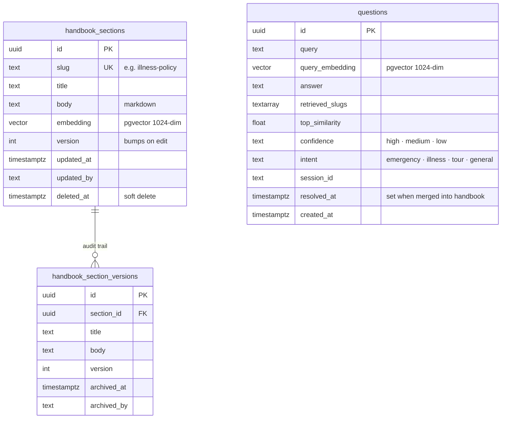

# Architecture

How the pieces fit together. Five diagrams, each answering a different question.

- [Components](#components): what services talk to each other
- [Chat request flow](#chat-request-flow): what happens when a parent asks a question
- [Ingestion flow](#ingestion-flow): how the handbook becomes searchable vectors
- [Operator flow](#operator-flow): how an operator fixes a gap
- [Data model](#data-model): what lives in Postgres

---

## Components

A map of the services in play and which code lives where. The app runs as a single Next.js 15 deployment on Vercel; two external AI providers (Voyage for embeddings, Anthropic for answers + classification) and one database (Supabase Postgres + pgvector).

**Legend.** Boxes inside `Vercel` and `Supabase` are our code / our data. Boxes outside are third-party APIs we call.

---

## Chat request flow

The moment a parent hits Send. Everything below happens inside a single streaming HTTP response; text starts flowing back to the browser within ~1.5 seconds of the POST (intent classify ≈ 300ms, embed ≈ 150ms, retrieval ≈ 50ms, then Sonnet tokens begin).

**Why the cache_control block matters.** The system prompt (which includes the retrieved handbook sections plus ~500 tokens of instructions) is cached with Anthropic's prompt caching for 5 minutes. Follow-up messages within the same window reuse the cache; you only pay the full context cost on the first turn of a conversation burst.

**Why emergency short-circuits.** Medical danger answers shouldn't depend on Voyage or Sonnet being up. The canned response routes the parent to 911 and the center's phone; it's also the one code path that never pays a per-request Sonnet cost.

---

## Ingestion flow

How markdown becomes searchable vectors. This runs once at project setup via `just seed`.

**Idempotent by slug.** Each section's slug (e.g. `illness-policy`) is a unique constraint in `handbook_sections`. Re-running `just seed` after a manual edit re-embeds and upserts in place. No duplicates, no deletes.

**After first seed, the DB is the source of truth.** Operator edits go through `/admin/handbook` (see the next diagram); the markdown file is no longer canonical.

---

## Operator flow

Two distinct operator journeys, both hitting the same live `handbook_sections` table. Each edit becomes visible to the chat on the very next parent query (retrieval runs fresh on every request).

**The flywheel.** Parent asks → chat logs the question with its confidence. Low-confidence questions accrue in `questions`. Operator visits `/admin/gaps`, reviews the clustered drafts, edits what needs editing, clicks Merge. The cluster's questions flip to `resolved`; the next parent asking about that topic gets a confident, cited answer from the new section.

---

## Data model

**Indexes.**
- `handbook_sections`: HNSW on `embedding` (cosine) for sub-millisecond retrieval.
- `questions`: HNSW on `query_embedding` (cosine) for gap clustering; btree on `created_at`, `confidence`, `intent`, `resolved_at` for operator filters.

**RPCs.**
- `match_handbook_sections(query_embedding, match_count)`: top-k by cosine. Called on every chat request.
- `match_questions(query_embedding, match_count, confidence_filter)`: top-k similar parent questions. Available for future operator tooling.

**RLS.** Row-level security is enabled on every table with **no policies**. All reads and writes go through the server using `SUPABASE_SECRET_KEY`, which bypasses RLS. If the admin UI ever needs direct browser access, authenticated policies go here.

---

## Trust and failure modes

- **Retrieval misses.** If no section is similar enough to the query, Claude is instructed to say so and suggest emailing the director rather than hallucinate. The empty-retrieval case is explicitly handled in `buildSystemPrompt`.
- **Intent mis-classification.** The Haiku classifier is conservative by prompt, and any SDK error, malformed JSON, or unknown intent falls back to `general`. It never fails open into `emergency`. Sonnet's own system prompt additionally redirects medical emergencies to 911 as a belt-and-suspenders guard.
- **Emergency short-circuit.** Bypasses Voyage and Sonnet entirely, so a Voyage or Anthropic outage does not block the most safety-critical answer.
- **Voyage outage.** `/api/chat` throws on embed failure. No retrieval, no Sonnet call, clean 500 to the browser with a retry-friendly error message.
- **Supabase outage.** Retrieval throws; same behavior.
- **Citation integrity.** Claude is instructed to use exact section titles from the retrieved context (e.g. `[§ Illness Policy]`). A future admin-UI pass can parse these markers to verify each citation points to a real section.
- **Question-log write failure.** `logQuestion` swallows insert errors. A logging outage never surfaces to the parent or interrupts the stream.
- **Abuse bounds.** Three layers: Anthropic monthly spend cap (hard stop on cost), Origin allowlist on mutating API routes (blocks drive-by POSTs), and per-message / per-conversation size caps (blocks "stuff a giant prompt" attacks before any vendor tokens are spent).
