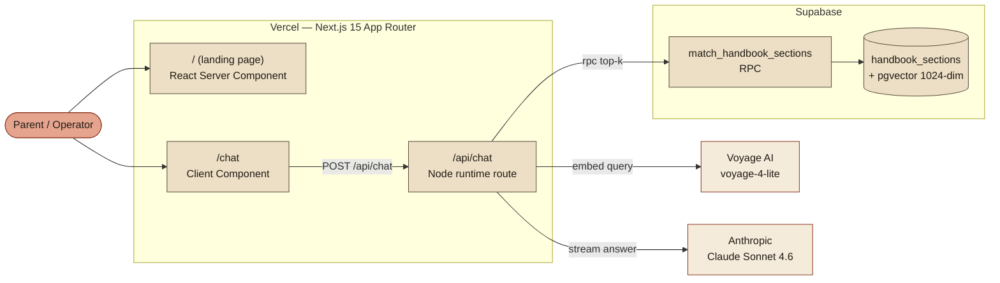
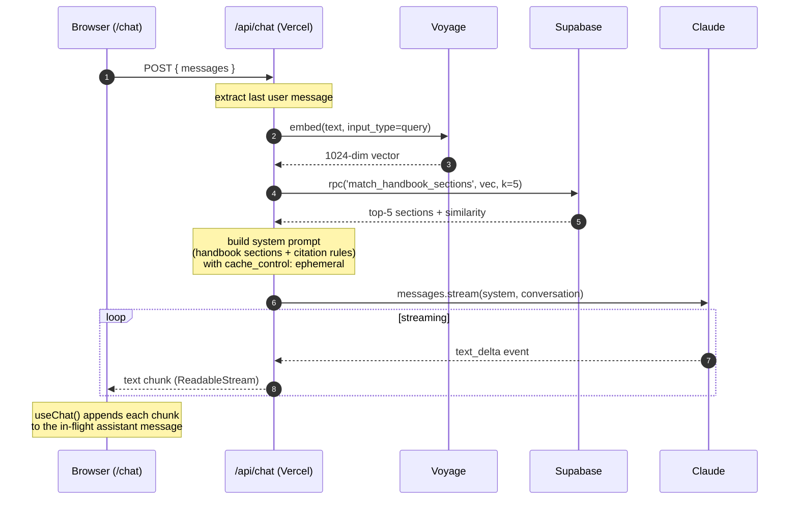
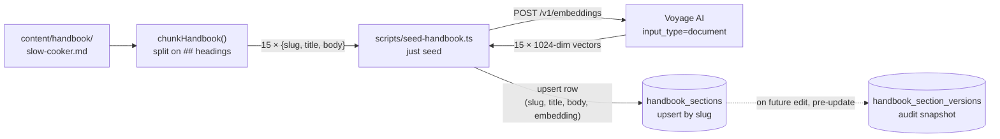
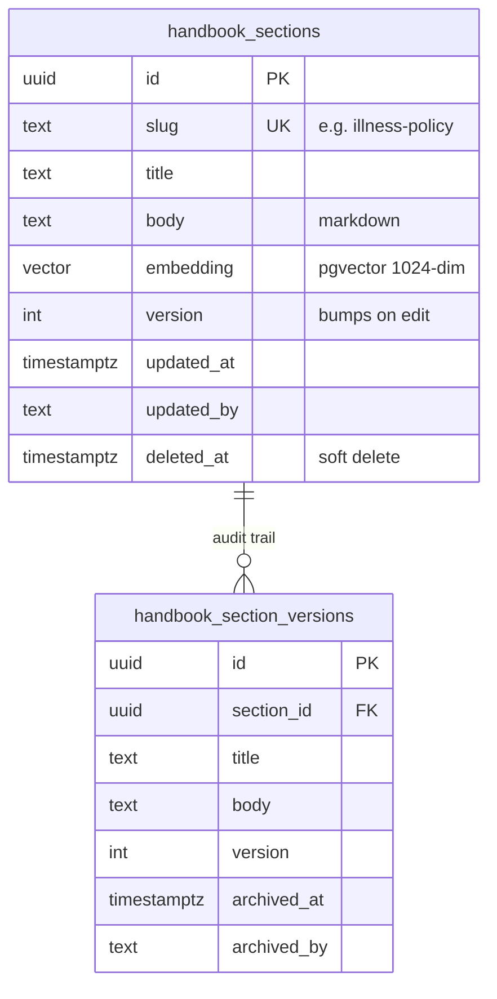

# Architecture

How the pieces fit together. Four diagrams, each answering a different question.

- [Components](#components) — what services talk to each other
- [Chat request flow](#chat-request-flow) — what happens when a parent asks a question
- [Ingestion flow](#ingestion-flow) — how the handbook becomes searchable vectors
- [Data model](#data-model) — what lives in Postgres

---

## Components

A map of the services in play and which code lives where. The app runs as a single Next.js 15 deployment on Vercel; two external AI providers (Voyage for embeddings, Anthropic for answers) and one database (Supabase Postgres + pgvector).

**Legend.** Boxes inside `Vercel` and `Supabase` are our code / our data. Boxes outside are third-party APIs we call.

---

## Chat request flow

The moment a parent hits Send. Everything below happens in a single streaming HTTP response — tokens start flowing back to the browser within a second of the embedding call finishing.

**Why the cache_control block matters.** The system prompt — which includes the retrieved handbook sections plus ~500 tokens of instructions — is cached with Anthropic's prompt caching for 5 minutes. Follow-up messages within the same window reuse the cache; you only pay the full context cost on the first turn of a conversation burst.

---

## Ingestion flow

How markdown becomes searchable vectors. Runs locally via `just seed`; can also run on save from the (future) operator dashboard.

**Idempotent by slug.** Each section's slug (e.g. `illness-policy`) is a unique constraint in `handbook_sections`. Re-running `just seed` after a handbook edit re-embeds and upserts in place — no duplicates, no deletes.

**Edit story.** When the operator dashboard lands, a section save triggers the same path: snapshot old row into `handbook_section_versions`, re-embed, upsert into `handbook_sections`. The chat endpoint reads a fresh retrieval on every request, so edits appear instantly with no cache-bust.

---

## Data model

**Index.** An HNSW index on `embedding vector_cosine_ops` keeps similarity search sub-millisecond even as the section count grows.

**RLS.** Row-level security is enabled on both tables with **no policies** — all reads and writes go through the server using `SUPABASE_SECRET_KEY`, which bypasses RLS. When the admin UI lands, authenticated policies go here.

---

## Trust & failure modes

- **Retrieval misses.** If no section is similar enough to the query, Claude is instructed to say so and suggest emailing the director rather than hallucinate. The empty-retrieval case is explicitly handled in `buildSystemPrompt`.
- **Emergency routing.** Claude is told in the system prompt to stop and direct to 911 for medical emergencies or suspected abuse, *before* citing handbook text.
- **Voyage outage.** The `/api/chat` route throws on embed failure — no retrieval attempt, no Claude call. Clean 500 to the browser; user sees a retry-friendly error message.
- **Supabase outage.** Retrieval throws; same behavior.
- **Citation integrity.** Claude is instructed to use exact section titles from the retrieved context (e.g. `[§ Illness Policy]`). The dashboard can later parse these markers to verify citations point to real sections.
